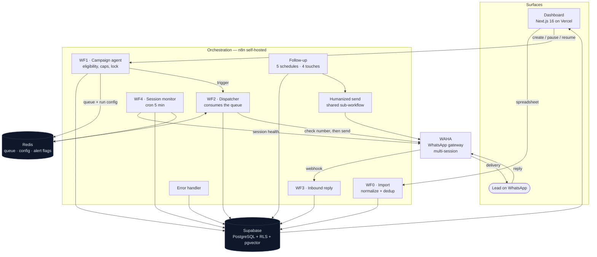

# ReativaLead

> **Multi-tenant WhatsApp outbound platform: campaign dispatch, 4-touch automated follow-up, and lead qualification for B2B sales teams.**
> Built for companies that generate leads through paid ads and lose most of them for lack of consistent follow-up.

> 📌 This repository is a **technical case study**. The product's source code is closed. What you'll find here is the architecture, the decisions that were worth arguing about, and what production taught me.
> Numbers verified against the live database on **2026-09-14**.

---

## The Problem

A company spends a few thousand reais a month on ads, generates 200 to 500 leads, and works maybe the first fifty. The rest sit in a spreadsheet. Three months later someone opens that spreadsheet, sees 400 names nobody ever called back, and closes it again — because re-contacting 400 people one by one is not a task a human does between meetings.

The failure isn't laziness, it's arithmetic. One operator with 500 leads can't make a first contact on all of them, let alone the four follow-up touches it takes for someone who ignored the first message to answer the fourth. And the moment you try to scale it by copy-pasting the same text 300 times, two things happen: the message reads like a blast, and WhatsApp starts treating you like one.

I built ReativaLead to make that base workable: re-warm it automatically, hold the cadence for a month, and hand the sales team only the people who actually replied.

It started aimed at real estate. By September 2026 essentially all the growth was general B2B prospecting — so the data model and the vocabulary went generic (`empresa`, `interesse`, `segmento`), and the real estate case became one vertical instead of the product.

## The Solution

| | Before | After |
|---|---|---|
| **First contact** | Manual, whoever the operator remembers | Filtered campaign, previewed, dispatched with per-lead personalization |
| **Follow-up** | Depends on human discipline; in practice, stops at touch 1 | 4 automated touches over ~1 month, no intervention |
| **Personalization** | Copy-paste, identical for everyone | Template rotation + spintax + variables resolved per lead |
| **Dead numbers** | Discovered by burning a send | Checked against WhatsApp before the send, marked in the base |
| **Operator's job** | Chase 500 people | Handle the ones who replied |
| **A number going down** | Nobody notices until someone asks why nothing sent | Detected within 5 minutes, alert + dashboard panel |

**How it runs.** The client uploads a spreadsheet (column mapping, phone normalization, dedup in the same pass). They register message templates. They create a campaign with filters, see a preview and how much of the daily plan cap it will consume, and confirm. From there the system takes over: it locks the selected leads, queues them, and dispatches at a deliberately human rhythm — 30 to 90 seconds between sends, with a long 5-to-10-minute pause on about 5% of them, only inside the client's configured business-hours window.

Whoever doesn't answer enters the follow-up cadence: four touches at roughly day 3, 8, 15 and 22, each at its own time of day (morning, late morning, early and late afternoon), Monday to Saturday, jittered. Whoever answers breaks the cycle — an inbound webhook flips the lead to "in conversation" and the automation stops touching them. The conversation is already in the client's own WhatsApp, where it belongs.

---

## Architecture

### Layers

| Layer | Technology | Responsibility |
|---|---|---|
| Frontend | Next.js 16 (App Router), TypeScript, Tailwind v4, shadcn/ui | Dashboard, inline CRM, campaigns, templates, admin console |
| Auth | Supabase Auth (JWT) | Login and the identity every RLS policy is built on |
| Database | Supabase / PostgreSQL | Leads, campaigns, templates, dispatch results, counters, error log |
| Vector store | pgvector, same database | Embedded product documentation for the in-app help assistant |
| Orchestration | n8n self-hosted (Docker Swarm) | 9 active workflows — the entire backend |
| Queue & ephemeral state | Redis | Per-tenant dispatch queue, run config, alert de-duplication flags |
| Messaging | WAHA (WhatsApp HTTP API), multi-session | Send, number verification, typing indicators, inbound webhook |
| Hosting | Vercel (frontend) · dedicated VPS (n8n, Redis, WAHA) | Clean front/back separation |

### The nine workflows

| Workflow | Job |
|---|---|
| Import | Column mapping, phone normalization, dedup against the base and within the file |
| Campaign agent | Eligibility query, plan-cap check, campaign record, lead lock, queue write, pause / cancel / resume |
| Dispatcher | Drains the queue, verifies the number, sends, records the result, re-reads campaign status before every send |
| Humanized send | Shared delivery sub-workflow: typing indicator, variable-length delays, message assembly |
| Follow-up | Five schedules — four touches plus a finalizer — grouped by client and sending session |
| Inbound reply | WhatsApp webhook; flips the lead to "in conversation" and records which stage they answered at |
| Session monitor | Every 5 minutes, checks each active WhatsApp session and alerts on a drop |
| Error handler | Catches any workflow failure into a table surfaced in the admin console |
| Help assistant + ingest | RAG over the product's own documentation, so clients ask the dashboard instead of asking me |

### Multi-tenancy

Isolation is enforced in **PostgreSQL, not in the application**. Every tenant table carries a `user_id = auth.uid()` row-level security policy, so an application bug leaks nothing: the database itself refuses to return another tenant's rows. Redis keys are namespaced per tenant. Each client runs its own WhatsApp session — some run more than one and rotate between them — with the session selected per campaign and recorded on every dispatch, so "which number sent this" is always answerable.

---

## Technical decisions

The four choices that actually cost me a weekend of thinking.

### 1. n8n as the backend, not serverless functions

**Decision.** All backend logic lives in self-hosted n8n workflows. There is no API server and no Lambda.

**The trade-off.** The follow-up flow alone is ~90 nodes across parallel branches. The same thing as code is perfectly writable — but every change becomes a deploy, and every production incident becomes remote debugging against logs. In n8n I get the execution history for free: I can open the run that misbehaved, see the exact payload at the exact node, and fix it in minutes.

**What I gave up.** A server to keep alive, with its cost and its maintenance, and a backend that's harder to unit-test than a function would be. I took it, because at this stage iteration speed on the message logic is worth more than testability of it. The compensating control is that the behavior that *must* be identical in two places — message assembly for campaigns and for follow-up — is documented as an explicit contract, with the divergence risk called out in the project's own technical directives.

### 2. A WhatsApp gateway on my own infrastructure, not the official Business API

**Decision.** Messaging goes through WAHA on my VPS, multi-session, rather than an official BSP.

**The trade-off.** The official API bills per message. A 1,000-lead campaign with four follow-up touches is 5,000 billable messages before a single reply. At the target client's price point that alone eats the subscription. Self-hosting turns a per-message cost into a fixed one.

**What I gave up.** Ban exposure, no verified badge, and a component that can silently stop working — which is precisely the risk described in the production challenge below, and precisely why the session monitor exists. The official API is planned as a premium-tier option that coexists with WAHA rather than replacing it: entry plans stay on the cheap path, high-volume plans buy stability.

### 3. The lead's own status is the lock — no join table, no lock service

**Decision.** A campaign doesn't store the list of lead IDs it owns. It flips those leads to a queued status, and that status *is* the claim.

**The trade-off.** I needed leads reserved by one campaign to be invisible to every other campaign, and I needed a paused campaign to keep holding its leads so it could resume exactly where it stopped. The obvious shapes — a join table, or a lock in Redis — both split the truth across two stores, and when Redis and Postgres disagree about who owns a lead, you get double sends. Putting the claim in the row the eligibility query already filters on makes the invariant structural: a queued lead cannot be selected by anything else, because every selector reads the same column. Resume rebuilds the queue from that status; cancel releases it; completion releases it.

**What I gave up.** A campaign that dies in a way that skips its cleanup path leaves leads reserved until someone cancels it, and the claim has no TTL. That failure mode is documented and visible in the UI rather than hidden, and a stuck campaign is one click from releasing its leads — acceptable at this scale, and a small enough surface that adding a reaper later is trivial.

### 4. Stateless template rotation instead of a counter

**Decision.** Which of the three templates a lead gets is derived from the lead's own UUID, not from a round-robin counter. Spintax variation inside the message is seeded the same way, from the lead ID plus the template type.

**The trade-off.** A counter has to be read, incremented and written under concurrency, from workflows running in parallel across tenants — that's a lock, or a race, or both. Deriving it from an identifier the lead already carries makes the assignment deterministic, reproducible and concurrency-free: the same lead always resolves to the same message, so a re-send never contradicts what was sent before.

**What I gave up.** Distribution isn't exactly 33/33/33 — UUID randomness leaves a few points of drift across a batch. Irrelevant for the purpose, which is that consecutive recipients don't receive byte-identical text.

---

## A production challenge: fail-open number verification

**The situation.** Before sending, the dispatcher asks the WhatsApp gateway whether a number exists — it's what keeps the base clean and what stops the system from burning sends on dead numbers. When the gateway answers "this number doesn't exist", the lead is marked invalid and permanently excluded from every future campaign. That's the correct behavior, and it's the desired one.

**The problem.** "The gateway says the number doesn't exist" and "the gateway didn't answer" are different facts that arrive through the same door. An HTTP client configured to treat any non-2xx as a failed check will collapse them — and the consequence isn't a failed send, it's a **permanent, silent, irreversible mislabeling of valid leads**. A gateway restart mid-campaign doesn't cost you the campaign; it quietly poisons every lead the campaign touched while it was down. Nothing errors loudly. The dispatch log fills, the campaign completes, and the damage surfaces weeks later as "why is a third of my base marked invalid?"

**How I found it.** The dispatch failure log was the tell. Failures carrying a real reason — `numero_inexistente` — are a per-number verdict and behave like one: scattered across campaigns, roughly proportional to base quality. But 48 of 85 recorded failures carried an **empty error payload** and clustered in time. A per-number verdict doesn't cluster. A per-number verdict always has a reason attached. An empty payload arriving in bursts isn't a statement about phone numbers at all — it's the shape of an infrastructure outage being recorded as a data-quality event.

**How I resolved it.** Two changes, at different layers.

At the request layer, the verification call now distinguishes transport failure from a negative verdict explicitly — full-response inspection with errors surfaced instead of swallowed, so the workflow can branch on *why* it didn't get a yes. No answer is no longer read as a "no": it's a retryable condition, not a verdict about the lead.

At the systems layer, I accepted that the real root cause was **not knowing the session was down**. A WhatsApp session can die from a container restart, a phone disconnect, or an expired pairing — and every consumer downstream just starts failing quietly. So I built a monitor: a five-minute cron that checks each active session, maps the gateway's state machine onto a status the product understands, writes it to the database, and alerts over WhatsApp on a drop and again on recovery. Alert repetition is suppressed with an expiring flag in Redis, so one outage is one message rather than one every five minutes — and an orphaned flag re-arms itself the next day instead of going deaf forever. Transitional states don't alert at all: a container restarting is not an incident. The dashboard reads the *recorded* state rather than polling the gateway live, and flags when the last check itself is stale, because the monitor going quiet is its own failure mode and should look like one.

**What I took from it.** Two things I now design for by default. First: when a system can mark something irreversibly, the code path that does it has to be able to prove *why* — and "no response" must never be allowed to satisfy that proof. Second: every external dependency that can fail silently needs a component whose only job is noticing, and that component has to make its own silence visible, otherwise you've moved the blind spot one layer up rather than removing it. The monitor has a known blind spot of its own, documented in the project's directives: the alerting session and a monitored session can be the same one. Naming it is how it stays a managed risk instead of a surprise.

---

## Results

In production since **June 2026**, verified against the live database on **2026-09-14**.

| System metric | Value |
|---|---|
| Leads under management | **2,214** |
| Campaign dispatches recorded | **752** |
| Campaigns executed | **96** (90 completed cleanly) |
| Leads carried through automated follow-up stages | **212** |
| Active message templates across tenants | **45** |
| Tenants dispatching | 3, across **4 WhatsApp sessions** |
| Numbers identified as invalid before wasting a send | **139** |

**Reading the numbers honestly.** The 752 dispatch records cover campaign sends; follow-up touches are tracked on the lead's stage rather than in the dispatch log, so that figure is a floor, not the total volume the system has delivered. And reply rate is deliberately not presented here as a product metric — it's overwhelmingly a function of each client's copy and list quality, and quoting my best client's number as if it were a platform guarantee would be dishonest. What the platform is accountable for is the line above it: that the sends happen, on cadence, to reachable numbers, without a human in the loop.

**Technical capacity.** Roughly 200 messages per hour per session, about 2,200 per day inside business hours. Plan caps (100 / 300 / 500 per day) sit deliberately *below* that ceiling — the binding constraint is account safety, not throughput, and the product is priced against the safe number rather than the achievable one.

---

## Known limitations

Stated plainly, because a case study that only lists wins isn't one.

- **No automatic lead intake.** Ingestion is spreadsheet upload. The CRMs in the original vertical don't expose an open API; for B2B it depends on the source platform. Webhook intake is the next integration.
- **Sequential processing above ~5,000 leads per campaign.** Batch processing in the orchestrator is sequential, so a campaign that size can run past 24 hours. Parallelization across sessions is the planned answer, and multi-session support is already in place.
- **Message bodies are not stored.** Neither outbound nor inbound text is persisted anywhere — good for data minimization, limiting for analytics. Any future per-message auditing has to be designed as an explicit, consented feature rather than a side effect.
- **Instrumentation boundary.** Follow-up delivery isn't written to the dispatch results table (it carries no campaign to attribute to), so reporting counts campaign sends only. Known, documented, and the reason the metrics above are framed as a floor.
- **Observability.** No dedicated APM. Detection runs on the orchestrator's execution history, the error table, and the session monitor. Adequate at this volume, explicitly a scale item.
- **Phone normalization is Brazil-specific.** Area-code and 9th-digit rules are hardcoded to the BR format. Another market means another normalizer — on both sides of the contract, since normalization exists in the importer and in the frontend dedup preview, and the two have to agree exactly.

## Roadmap

- First full-scale campaign (2,000+ leads) with per-session stability metrics
- Official WhatsApp Business API as a premium-tier option alongside the self-hosted gateway
- Real-time operator notification on reply
- Webhook intake from CRMs and capture platforms
- Parallel dispatch across sessions, to break the sequential ceiling

---

## Stack

**Frontend** — Next.js 16 (App Router), TypeScript, Tailwind CSS v4, shadcn/ui
**Backend / orchestration** — n8n, self-hosted on Docker Swarm; 9 active workflows
**Database** — PostgreSQL via Supabase: row-level security on every tenant table, a partial unique index for phone dedup scoped per tenant, pgvector for the help assistant's document store
**Queue & ephemeral state** — Redis: per-tenant dispatch queue, run config, expiring alert flags
**Messaging** — WAHA (self-hosted WhatsApp HTTP API), multi-session
**AI** — RAG help assistant over the product's own documentation, embedded into pgvector and re-ingested from markdown
**Auth** — Supabase Auth, JWT, RLS keyed on `auth.uid()`
**Hosting** — Vercel (frontend), dedicated VPS (orchestrator, Redis, gateway)

---

## About

Built by [Guilherme Bosco](https://github.com/Guilherme-Bosco), co-founder of [Mind in Shift](https://mindinshift.com.br), an automation and AI agency.

Product or technical-consulting contact: [contato@mindinshift.com.br](mailto:contato@mindinshift.com.br) · [LinkedIn](https://www.linkedin.com/in/guilherme-bosco-dos-santos-012bb620b/)
