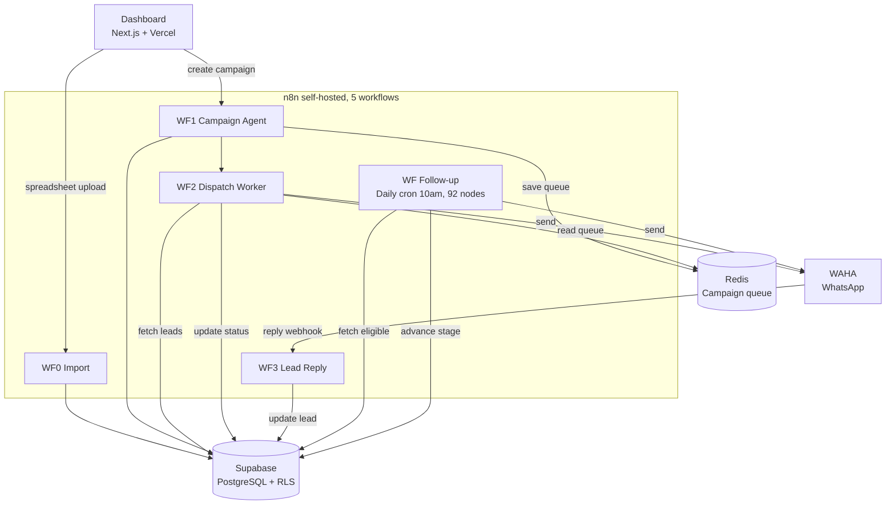

# ReativaLead

> **Outbound prospecting and mass-dispatch platform via WhatsApp.**
> Built for sales teams that invest in paid ads and lose most of the leads they generate for lack of consistent follow-up. Initial go-to-market focus on real estate, with a generic architecture that fits any sector that needs to reactivate a lead base at scale.

  

> 📌 This repository is a technical case study of ReativaLead. The product's source code is closed. Here you'll find the architecture, technical decisions, and the current state of the project.

---

## The Problem

Companies that invest in paid ads lose most of the leads they generate because they lack the operational capacity to follow up consistently at scale.

The most visible case is small real estate brokerages that spend R$2,000 to R$5,000 a month on Meta Ads or Imoblead, generate 200 to 500 leads a month, and never re-contact most of that base. But the same pattern shows up in any sector that depends on ad capture: clinics, gyms, courses, services.

The reason is structural, not a lack of will:

- **Volume.** An operator with 500 leads in a spreadsheet can't call all of them, let alone make 4 follow-up touches on each one.
- **Consistency.** Manual follow-up depends on discipline. The team prioritizes new leads and the old base becomes a graveyard.
- **Personalization at scale.** Copying and pasting a personalized message for 300 leads on WhatsApp is unfeasible: it takes hours and is error-prone.

The result: most of the ad investment is wasted because the lead never even receives the first re-engagement message.

## The Solution

ReativaLead automates the re-warming of that dormant base and the initial qualification over WhatsApp, handing the sales team **only the leads that showed interest**.

### Main features

- **Smart spreadsheet import.** CSV/XLSX upload with header auto-detection, flexible column mapping, phone normalization, and duplicate merging.
- **Campaign with template rotation.** 3 messages per type, alternating automatically across leads, with a pre-send WhatsApp check before sending.
- **Automatic 4-touch follow-up.** The system moves the lead through 4 stages (3, 5, 7, 7 days) with no intervention. Each stage has its own templates.
- **Editable inline CRM.** Status, stage, priority, and notes editable straight from the table, without opening forms.
- **Dashboard with real-time metrics.** Conversion funnel, response rate per follow-up stage, daily and monthly limit control.

### Operator flow

1. Log into the dashboard
2. Import the lead spreadsheet (drag-and-drop, map columns, confirm)
3. Register message templates (3 per type)
4. Create a campaign applying filters, preview it, confirm the dispatch
5. The system runs it with a random delay (12 to 25 seconds between sends)
6. Follow-ups fire on the following days with no manual action
7. The operator handles **only the leads that replied**

### Lead flow

The lead receives a personalized message on WhatsApp. Silence triggers follow-up 1 after 3 days. Silence triggers follow-up 2 after 5 days. Then 2 more 7-day touches. If still silent after that, the lead is marked as finished. A reply at any stage breaks the cycle and notifies the operator.

---

## Architecture

### Layers

| Layer | Technology | Responsibility |
|---|---|---|
| Frontend | Next.js 16, TypeScript, Tailwind, shadcn/ui | Dashboard, CRM, campaigns, templates |
| Authentication | Supabase Auth | Login, JWT, foundation for RLS |
| Database | Supabase (PostgreSQL) | Leads, campaigns, templates, counters |
| Automation | n8n self-hosted on Docker Swarm | 5 workflows orchestrating the backend |
| Queue | Redis | Per-campaign dispatch queue |
| Messaging | WAHA (WhatsApp HTTP API) | Sending, number verification, reply webhook |
| Deploy | Vercel (front) and VPS (backend) | Clear front/back separation |

### Multi-tenancy

Isolation through **PostgreSQL's native Row-Level Security (RLS)**. Every table has a `user_id = auth.uid()` policy, so one client never sees another's data, even if the application has a bug. Redis uses keys prefixed by `user_id` (`disparo:{user_id}:fila`). Onboarding a new client takes ~15 minutes through the admin dashboard.

---

## Technical decisions

Some choices were worth debating before they became code.

### 1. n8n self-hosted instead of serverless functions

**Decision.** All backend logic runs in self-hosted n8n workflows (Docker Swarm), not in Lambda, Edge Functions, or a traditional API server.

**Why.** The follow-up flow has 92 nodes across 5 parallel branches. Managing that complexity in serverless code would be impractical. Any change would require a full deploy and remote debugging. In n8n, the flow is visual, debuggable node by node, and every execution is recorded in the history.

**Trade-off.** I have to keep a server up, with the cost and maintenance that come with it. In exchange, I get absurd iteration speed. A follow-up change that would take half a day in code takes 15 minutes in n8n.

### 2. WAHA self-hosted as the default, official WhatsApp Business API as a future premium option

**Decision.** Messaging via WAHA (a self-hosted WhatsApp HTTP API) on my own VPS, not via the official WhatsApp Business API / a commercial BSP.

**Why.** Cost. The official API charges R$0.15 to R$0.80 per message. In a campaign of 1,000 leads with 4 follow-up touches, that already adds up to R$600 to R$3,200. Unfeasible for the target client's average ticket in the MVP.

**Trade-off.** Higher ban risk, lower stability, no verified badge — a conscious trade-off. The official WhatsApp Business API is planned as a future option that will coexist with WAHA across different plans (WAHA on entry plans, the official API on premium plans).

### 3. Redis as a queue instead of BullMQ or SQS

**Decision.** The campaign queue lives in simple Redis keys (`LPUSH`, `RPOP`), with no dedicated worker.

**Why.** n8n itself is the consumer. It reads Redis inside the workflow. Adding BullMQ would require a separate Node.js worker just to run the queue, doubling the maintenance surface for marginal gain.

**Trade-off.** No automatic retry, no dead-letter queue. Accepted for the current volume (under 1,000 leads per campaign). If the operation grows past that, I'll switch to BullMQ.

### 4. Template rotation by UUID hash instead of stateful round-robin

**Decision.** To distribute the 3 templates across N leads, it uses the last character of the lead's UUID as a seed (`hex % 3`).

**Why.** Stateless. No global counter needed, no lock, no race condition. Each lead gets its deterministic template based on its own UUID.

**Trade-off.** The distribution isn't exactly 33/33/33. The randomness of UUIDs produces a variation of a few points. Accepted.

---

## Current state

**In production, with 2 active pilots for ~2 months.** First pilot client, a real estate brokerage in Pelotas-RS (~1,800 leads in the base), plus internal use by Mind in Shift itself for the agency's own sales prospecting.

Cumulative numbers over the period:

| Metric | Value |
|---|---|
| Initial dispatches executed | **400** |
| Replies received | **80** (a **20%** rate) |
| Leads in the final qualification stage before signing | **2** |
| Clients in production | 2 |

The **20% response rate is above the typical benchmark for cold outreach over WhatsApp** (usually 5 to 10%), which validates the combined effect of template rotation, per-variable personalization, and pre-send number verification.

### Technical capacity

- ~200 messages per hour per instance
- ~2,200 per day within business hours
- Plan limits (100, 300, or 500 per day) are intentionally below the technical capacity, as a safety margin against bans

### Next validation

The first real-scale campaign (~1,800 leads from the pilot brokerage's base) is underway. The goal is to measure the response rate at higher volume and validate WAHA's stability at that level. It's the only relevant gap between the current state and operation at scale.

---

## Known limitations

- **No automatic lead intake.** For the initial real estate focus, the sector's CRMs (Imoblead and similar) don't offer an open API. Intake happens via manual spreadsheet upload. For other sectors, the integration depends on the availability of the CRM's or capture platform's API. An integration webhook is planned when feasible.
- **Volume above 5,000 leads per campaign.** n8n's `SplitInBatches` processes sequentially. Campaigns of that size can take more than 24 hours. Next step: parallelization with multiple instances.
- **Limited observability.** No dedicated APM (Sentry, Datadog). Error detection via n8n and Supabase logs. Acceptable at the current volume, planned for scale.
- **Internationalization.** Phone normalization assumes the Brazilian format (2-digit area code + 9 digits). Adaptation needed for other markets.

---

## Roadmap (next 3 to 6 months)

- First scale campaign (1,800+ leads) with real response-rate metrics
- Official WhatsApp Business API as a premium-plan option, coexisting with WAHA (higher stability, lower ban risk, verified badge)
- Product landing page and acquisition funnel
- 5 to 10 paying clients
- Real-time notification to the operator when a lead replies
- Integration with webhooks from CRMs and capture platforms (Imoblead as a priority, given the initial real estate focus)

---

## Stack

- **Frontend.** Next.js 16, TypeScript, Tailwind CSS, shadcn/ui
- **Backend.** n8n 2.17.7 (self-hosted on Docker Swarm), Edge Functions (Supabase)
- **Database.** PostgreSQL (Supabase) with native RLS, 8 main tables, a partial unique index on `(user_id, telefone)` for duplicate merging
- **Cache and queue.** Redis 7.4 Alpine
- **Messaging.** WAHA (self-hosted WhatsApp HTTP API); official Business API planned as a premium-plan option
- **AI.** GPT-4o-mini (OpenAI) for the Chatwoot conversational agent after a reply
- **Auth.** Supabase Auth, JWT, RLS by `auth.uid()`
- **Hosting.** Vercel (frontend), dedicated VPS (n8n, Redis, WAHA)

---

## About

Built by [Guilherme Bosco](https://github.com/Guilherme-Bosco), co-founder of [Mind in Shift](https://mindinshift.com.br), an automation and AI agency in Jacareí-SP.

For contact about the product or technical consulting on automation: [contato@mindinshift.com.br](mailto:contato@mindinshift.com.br), [LinkedIn](https://www.linkedin.com/in/guilherme-bosco-dos-santos-012bb620b/).
