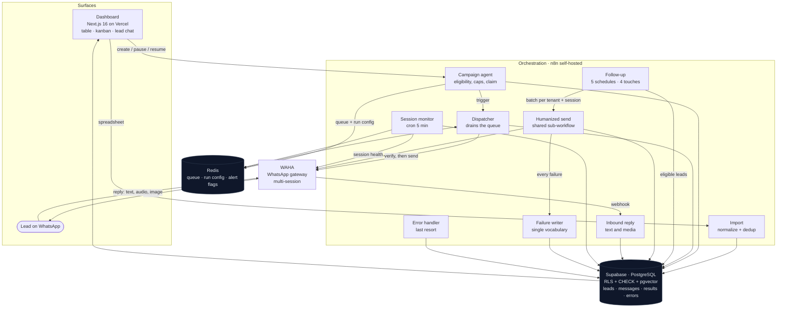

# ReativaLead

> **Multi-tenant WhatsApp outbound platform: campaign dispatch, 4-touch automated follow-up, and lead qualification for B2B sales teams.**
> Built for companies that generate leads through paid ads and lose most of them for lack of consistent follow-up.

> 📌 This repository is a **technical case study**. The product's source code is closed. What you'll find here is the architecture, the decisions that were worth arguing about, and what production taught me.
> Every number below was verified against the live database on **2026-09-28**.

---

## The Problem

A company spends a few thousand reais a month on ads, generates 200 to 500 leads, and works maybe the first fifty. The rest sit in a spreadsheet. Three months later someone opens that spreadsheet, sees 400 names nobody ever called back, and closes it again, because re-contacting 400 people one by one is not a task a human does between meetings.

The failure isn't laziness, it's arithmetic. One operator with 500 leads can't make a first contact on all of them, let alone the four follow-up touches it takes for someone who ignored the first message to answer the fourth. And the moment you try to scale it by copy-pasting the same text 300 times, two things happen: the message reads like a blast, and WhatsApp starts treating you like one.

I built ReativaLead to make that base workable: re-warm it automatically, hold the cadence for a month, and hand the sales team only the people who actually replied.

It started aimed at real estate. By September 2026 essentially all the growth was general B2B prospecting, so the data model and the vocabulary went generic (`empresa`, `interesse`, `segmento`), and the real estate case became one vertical instead of the product.

## The Solution

| | Before | After |
|---|---|---|
| **First contact** | Manual, whoever the operator remembers | Filtered campaign, previewed, dispatched with per-lead personalization |
| **Follow-up** | Depends on human discipline; in practice, stops at touch 1 | 4 automated touches over ~1 month, no intervention |
| **Personalization** | Copy-paste, identical for everyone | Template rotation and inline variants, both seeded per lead |
| **Dead numbers** | Discovered by burning a send | Checked against WhatsApp before the send, recorded in the base |
| **Where the lead stands** | One column overwritten by four different writers | Two independent axes, each with one owner, enforced by database constraints |
| **The conversation** | Only in the operator's phone | Stored both ways and readable inside the lead's drawer |
| **Operator's job** | Chase 500 people | Work three daily queues: replies waiting, follow-ups due, remarketing |
| **A failure** | Silence | Recorded with a cause, or explicitly recorded as "cause unknown" |

**How it runs.** The client uploads a spreadsheet (column mapping, phone normalization, dedup in the same pass). They register message templates. They create a campaign with filters, see a preview and how much of the daily plan cap it will consume, and confirm. From there the system takes over: it claims the selected leads, queues them, and dispatches at a deliberately human rhythm, 30 to 90 seconds between sends with a long pause on a fraction of them, only inside the client's configured business-hours window. Which of the three templates a lead receives, and which variant of each interchangeable phrase, are both derived from the lead's own id, so the assignment is deterministic and needs no shared counter to coordinate parallel runs.

Whoever doesn't answer enters the follow-up cadence: four touches at day 3, 8, 15 and 22, each on its own schedule during the day, Monday to Saturday, jittered. Seven days after the fourth touch with no reply, the lead is discarded. Whoever answers breaks the cycle: an inbound webhook moves them to "in conversation" and clears the cadence date, which is the single gate that decides whether automation may touch a lead at all. A reply by audio or image counts exactly like a reply by text.

---

## Architecture

### Layers

| Layer | Technology | Responsibility |
|---|---|---|
| Frontend | Next.js 16 (App Router), TypeScript, Tailwind v4, shadcn/ui | Dashboard, inline CRM, kanban board, lead conversation, campaigns, admin console |
| Auth | Supabase Auth (JWT) | Login and the identity every RLS policy is built on |
| Database | Supabase / PostgreSQL | Leads, campaigns, templates, dispatch results, message bodies, counters, error log |
| Vector store | pgvector, same database | Embedded product documentation for the in-app help assistant |
| Orchestration | n8n self-hosted (Docker Swarm) | 10 active workflows, the entire backend |
| Queue and ephemeral state | Redis | Per-tenant dispatch queue, run config, alert de-duplication flags |
| Messaging | WAHA (WhatsApp HTTP API), multi-session | Send, number verification, typing indicators, inbound webhook |
| Hosting | Vercel (frontend), dedicated VPS (n8n, Redis, gateway) | Clean front/back separation |

### The ten workflows

| Workflow | Job |
|---|---|
| Import | Column mapping, phone normalization, dedup against the base and within the file |
| Campaign agent | Eligibility query, plan-cap check, campaign record, lead claim, queue write, pause / cancel / resume |
| Dispatcher | Drains the queue, verifies the number, sends, records the result, re-reads campaign status before every send |
| Humanized send | Shared delivery sub-workflow: typing indicator, warm-up curve, variable delays, message assembly, and a recorded outcome for every path |
| Follow-up | Five schedules (four touches plus a discard pass), eligibility by funnel stage, counter and due date, capped per tenant |
| Inbound reply | WhatsApp webhook: classifies the event, stores the message, moves the lead to "in conversation", clears the cadence |
| Session monitor | Every 5 minutes, checks each active WhatsApp session and alerts on a drop and on recovery |
| Failure writer | Single writer for in-flow failures, the only place the severity vocabulary actually exists |
| Error handler | Last resort for a workflow that died outright, deliberately independent of the writer above |
| Help assistant + ingest | RAG over the product's own documentation, so clients ask the dashboard instead of asking me |

### Multi-tenancy

Isolation is enforced in **PostgreSQL, not in the application**. Every tenant table carries a `user_id = auth.uid()` row-level security policy, so an application bug leaks nothing: the database itself refuses to return another tenant's rows. Redis keys are namespaced per tenant. Each client runs its own WhatsApp session, and some run more than one and rotate between them. The session is selected per campaign and recorded on every dispatch, so "which number sent this" is always answerable.

One incident shaped the rule: an inbound-reply lookup that searched by phone number **without** scoping to the tenant, taking the first match. Two numbers existed in two accounts, and 119 history rows landed under the wrong owner, where row-level security then made them invisible to the account that should have seen them. Tenant scope now comes first in every lookup, and the gateway session is what resolves it, since the session is the only identifier an inbound webhook carries.

---

## Technical decisions

The four choices that actually cost me a weekend of thinking.

### 1. One column was carrying two meanings, so I split it in two

**Decision.** The lead's state lives on **two independent axes**: a dispatch status (may automation touch this lead?) and a funnel stage (where is this person in the conversation?), plus a counter for how many follow-up touches have gone out and a single date that gates the cadence. Each axis has exactly one automated owner, and the vocabulary of both is enforced by `CHECK` constraints in the database.

**The trade-off.** The original design had one status column holding both facts, written by four workflows with no hierarchy, so the last write won. The audit that triggered this found the cost: **86 leads had a recorded reply and were sitting in a state that made them eligible for automated follow-up anyway**, because a later dispatch had overwritten the fact that they had answered. The dashboard reported a reply rate of about 10% while the history said 57%, since the metric was computed from a column that kept being overwritten. Splitting the axes makes the invariant structural instead of procedural: the send path is not allowed to write a commercial stage, the reply path is not allowed to write a dispatch status, and follow-up eligibility reads only stages that mean "hasn't answered yet". Someone who replied cannot re-enter the automation by accident, because the query that selects targets cannot see them.

**What I gave up.** Two columns to keep coherent instead of one, a migration with a backfill and a kept snapshot table, and a vocabulary now locked at the database level, so adding a value requires DDL. That last part is deliberate: a value outside the contract now fails loudly on write instead of passing silently and being discovered months later in a report.

### 2. n8n as the backend, not serverless functions

**Decision.** All backend logic lives in self-hosted n8n workflows. There is no API server and no Lambda.

**The trade-off.** The delivery sub-workflow alone is around 38 nodes, and the follow-up flow is larger. The same thing as code is perfectly writable, but every change becomes a deploy, and every production incident becomes remote debugging against logs. In n8n I get the execution history for free: I can open the run that misbehaved, see the exact payload at the exact node, and fix it in minutes.

**What I gave up.** A server to keep alive, with its cost and its maintenance, and a backend that's harder to unit-test than a function would be. I took it, because at this stage iteration speed on the message logic is worth more than testability of it. The compensating control is that behavior which must be identical in two places, message assembly for campaigns and for follow-up, is documented as an explicit contract, with the divergence risk called out in the project's own technical directives.

### 3. A WhatsApp gateway on my own infrastructure, not the official Business API

**Decision.** Messaging goes through a self-hosted gateway on my VPS, multi-session, rather than an official BSP.

**The trade-off.** The official API bills per message. A 1,000-lead campaign with four follow-up touches is 5,000 billable messages before a single reply. At the target client's price point that alone eats the subscription. Self-hosting turns a per-message cost into a fixed one.

**What I gave up.** Ban exposure, no verified badge, and a component that can silently stop working, which is precisely the risk described in the challenges below and precisely why the session monitor exists. The official API is planned as a premium-tier option that coexists with the self-hosted path rather than replacing it: entry plans stay on the cheap path, high-volume plans buy stability.

### 4. The claim on a lead lives in the lead's own row

**Decision.** A campaign doesn't store the list of lead ids it owns. It marks those leads as queued and stamps them with the campaign id. The status says *that* a lead is claimed; the campaign id says *by whom*.

**The trade-off.** I needed leads reserved by one campaign to be invisible to every other campaign, and a paused campaign to keep holding its leads so it could resume exactly where it stopped. Both obvious shapes, a join table or a lock in Redis, split the truth across two stores, and when Redis and Postgres disagree about who owns a lead you get double sends. Putting the claim in the row that the eligibility query already filters on makes the invariant structural: a claimed lead cannot be selected by anything else, because every selector reads the same column.

**What it cost to get right.** The first version stored only *that* a lead was claimed, not by whom. A client cancelled a two-lead campaign and the release, scoped only by owner and status, freed **11 leads that belonged to a different, paused campaign**. Six seconds later the resume on that other campaign answered "no leads available". The fix was the second half of the claim: release, resume and completion are all scoped by campaign id, and the migration that added it is part of the schema history. The remaining cost is that the claim has no TTL, so a campaign that dies skipping its cleanup path holds its leads until someone cancels it. That's visible in the UI rather than hidden, and one click from release.

---

## Production challenges

### 1. The system that never reported an error

**The situation.** "The system doesn't give errors" sounds like a compliment until you check the error table. On 2026-09-28 it had **five rows since the project began, all five written by the session monitor**. The central error handler, wired as the error workflow across production flows, had never written a single line.

**The problem.** That isn't robustness, it's arithmetic of a different kind. The error handler only fires when a workflow **dies**, and almost every node in these flows is configured to continue on failure, precisely so that one bad lead cannot destroy a batch of fifty. The combination means a workflow finishes "successfully" having failed in the middle. Two different classes of problem existed, and only the first had an owner:

| Class | Who caught it | Example |
|---|---|---|
| The workflow broke | Error handler | invalid expression, expired credential |
| An action failed and the workflow carried on | **nobody** | send rejected, write refused by a constraint, session offline |

The second class was the entire follow-up path. The delivery sub-workflow is called only by follow-up, and it recorded **nothing** on failure, so every failed follow-up send was invisible: not in the results table, not in the error log, not on the dashboard. Three specific holes were worse than a plain missing log:

- The queue builder returned an **empty array** when the batch was empty or the capacity math produced zero. In n8n an empty item set ends the run: no sends, no warning, no return value to the caller. The whole workflow completed green having done nothing at all. I found it by accident, in a test where the sending window happened to be 2.4 minutes wide.
- A lead skipped for missing data was never touched, so its due date stayed in the past. It was re-selected every day, skipped every day, and **burned one of the ten daily slots for that touch indefinitely**, starving leads behind it.
- The message assembly step runs per lead on database data and had no guard. One malformed record could throw and take **the rest of the batch** with it, unrecorded.

**How I found it.** Two signals. First, the error table's row count against the execution history: zero runs marked as failed, which for a system doing real work is not plausible. Second, the failure reasons already stored: **41 rows whose recorded cause was the literal string `{}`**, all of them clustered between June 9 and July 1. An empty object is what `JSON.stringify` produces from a response body that wasn't there. It is not a cause, it's the absence of one, written down as if it were.

**How I resolved it.** A single writer for in-flow failures, and a rule about what it may claim. The writer is the only place the severity vocabulary exists, because the table has no constraint to enforce it: if every workflow inserts its own rows there's no convention, only intentions. It searches the payload for a usable cause in several shapes, treats an empty object or array as **not a cause**, and when nothing usable exists writes "unidentified failure" rather than inventing one. Identifiers that aren't valid UUIDs are dropped instead of dirtying the row. It never blocks its caller when it fails, and it keeps retries on, because the rule against retrying is about the messaging gateway and account safety, not about the database, and a log that disappears when the network is bad disappears exactly when it matters.

Around it, the specific holes were closed: the queue builder now always emits at least one item carrying an explicit "nothing to send" reason (empty batch, outside the window, cap exhausted); a skipped lead is rescheduled forward so it stops re-entering the queue every day, except when the cause is a missing template, which is configuration and must resume the instant it's fixed; and message assembly runs inside a guard, turning an exception into a recorded skip for that one lead while the batch continues.

The error handler deliberately still writes **directly**, without going through the new writer. It's the last-resort path, and making it depend on another workflow being published and healthy would add a failure mode exactly where none is allowed.

**What I took from it.** Continue-on-failure is the right default for batch work and a silence generator by default. Every place it's used has to answer "and who records this?" before it ships. Seven failure scenarios were then exercised against the real database and cleaned up afterwards: empty batch, zero capacity, cap exhausted, partial discard, a batch cut off by the closing window, six leads skipped for missing data, and a number that doesn't exist. Seven records where there had been nothing.

**One path I will not claim is proven.** I could not make the gateway reject a send in production: it accepts even empty text and answers 2xx. That branch's reason-normalizing logic was tested in isolation against seven response shapes, including an empty body, which now yields "HTTP 500 with no body" rather than `{}`, and its wiring is identical to branches proven end to end. It's the first thing I check on the first day of follow-up running at volume. I would rather write that sentence than imply coverage I don't have.

### 2. Fail-open number verification

**The situation.** Before sending, the dispatcher asks the gateway whether a number exists on WhatsApp. When the answer is no, the lead is marked invalid and permanently excluded from every future campaign. That's correct and desired: it's what keeps the base clean.

**The problem.** "The gateway says the number doesn't exist" and "the gateway didn't answer" are different facts arriving through the same door. An HTTP client that treats any non-2xx as a failed check collapses them, and the consequence isn't a failed send, it's a **permanent, silent mislabeling of valid leads**. A gateway restart mid-campaign doesn't cost you the campaign; it quietly poisons every lead the campaign touched while it was down, and the damage surfaces weeks later as "why is a third of my base marked invalid?"

**How I resolved it.** At the request layer, the health check that the monitor performs inspects the full response and surfaces transport errors instead of swallowing them, which is what separates "the gateway said it's down" from "the gateway said nothing". At the systems layer, I accepted that the real root cause was **not knowing the session was down**, and built a monitor: a five-minute cron that checks each active session, maps the gateway's state machine onto a status the product understands, records it, and alerts on a drop and again on recovery. Repetition is suppressed with an expiring flag, so one outage is one message rather than one every five minutes, and an orphaned flag re-arms itself the next day instead of going deaf. Transitional states don't alert at all, because a container restarting is not an incident. The dashboard reads the recorded state rather than polling live, and flags when the last check is itself stale, because the monitor going quiet is its own failure mode.

**What's still open, and why I'm saying so.** The verification call in the send path still fails open. What changed is that it now **leaves a trace**: the outcome is recorded with a cause, so an anomalous spike of "number doesn't exist" is visible instead of invisible, and the monitor independently reports the outage that would explain it. Detection came first because detection is what makes the remaining fix safe to sequence. Closing it belongs to the same change that consolidates campaign and follow-up onto one send path, which is deliberately scheduled last: it's the change with the widest blast radius, and it only became safe once the shared path recorded everything the older one did.

### 3. My test payloads were cleaner than reality

**The situation.** Media had to count as a reply. A lead answering with a voice note was not being recognized, kept an active cadence date, and **carried on receiving follow-ups after having replied**, which is the worst thing this product can do.

**The problem.** The original filter discarded any event without a text body, which is a reasonable-looking rule and the wrong one: it cuts on absence of text rather than on "this isn't a message". Removing it naively is also wrong, because of one specific trap. **An emoji reaction arrives with the emoji in the body field.** Without an explicit exclusion, a thumbs-up would have been classified as a text reply and moved the lead to "in conversation", stopping a cadence that should have continued.

So the classification had to be positive: derive the type from the message envelope, unwrap the wrappers the protocol uses (ephemeral, view-once, edited, document-with-caption), fall back to the media mimetype when the key is unknown, and land on "other" as a last resort so that a new media type **enters as unknown instead of vanishing**, which was the original defect in a different costume.

**The part worth telling.** I validated it with five forged events, and all five passed. Then real audio and real images were still being discarded. The cause is a detail of the underlying protocol: alongside the content key, every real message carries **encryption metadata as a sibling key**. My first version asked "does this event contain a blocked key?", and treated that metadata as if it were a message type, so every genuine media message failed the test while type and duration were computed perfectly. My forged payloads didn't include the metadata, because I had written them from the content outward.

**How I resolved it.** The classifier now separates content keys from metadata keys explicitly, and only content decides type and eligibility. Then it was re-exercised against captured real events rather than authored ones, and the duration field path was confirmed from a real recording instead of inferred from generic documentation.

**What I took from it.** A fixture written from the happy path is a description of my own assumptions, and it will pass. If a test payload doesn't carry the noise that production carries, the test is cleaner than reality and proves less than it appears to. Capture first, then forge. The same instinct now applies to anything that decides by key presence: presence is not a type, and a schema with metadata siblings punishes that shortcut precisely where it hurts, in the branch that discards data.

---

## Results

In production since **June 2026**. Verified against the live database on **2026-09-28**.

| System metric | Value |
|---|---|
| Leads under management | **2,243** |
| Recorded interactions (sends, replies, failures) | **1,065** |
| Messages delivered | **735** |
| Replies recorded | **206** |
| Leads carried through at least one automated follow-up touch | **243** |
| Leads in commercial stages (in conversation and beyond) | **131** |
| Campaigns executed | **137** (127 completed cleanly) |
| Numbers identified as invalid before wasting further sends | **184** |
| Active message templates across tenants | **45** |
| Tenants dispatching | 3, across **4 WhatsApp sessions** |

**Reading the numbers honestly.** Reply rate is deliberately not presented here as a product metric. It's overwhelmingly a function of each client's copy and list quality, and quoting my best client's number as if it were a platform guarantee would be dishonest. What the platform is accountable for is the line above it: that sends happen, on cadence, to reachable numbers, without a human in the loop, and that everything which fails is written down. Conversation history exists only from 2026-09-28 forward, when the message table shipped; what was exchanged before that lives in WhatsApp and is not recoverable through the API.

**Technical capacity.** Roughly 200 messages per hour per session, about 2,200 per day inside business hours. Plan caps (100 / 300 / 500 per day) sit deliberately *below* that ceiling, and automated follow-up is capped harder still: ten leads per tenant per touch, so at most forty a day per account even when a backlog exists. Re-enabling an account that has been off for months therefore **reschedules** rather than discharging the backlog at once, and anything more than 45 days overdue leaves the cadence entirely and becomes manual remarketing. The binding constraint is account safety, not throughput.

---

## Known limitations

Stated plainly, because a case study that only lists wins isn't one.

- **No automatic lead intake.** Ingestion is spreadsheet upload. The CRMs in the original vertical don't expose an open API; for B2B it depends on the source platform. Webhook intake is the next integration.
- **Two send paths still exist.** Campaigns have their own send chain, older than the shared one. The consolidation is designed and deliberately scheduled last, after the shared path could record everything the older one already recorded. Until then, message assembly exists in two places that must be changed together, which is documented rather than assumed.
- **The template actually used isn't identifiable.** The history stores the rotation index, not the template id, so editing a template rewrites the meaning of past records. The direct consequence is that **this system cannot run a template A/B test**, and saying otherwise would be a sales claim, not a technical one.
- **Media content is not stored.** Type and duration are recorded; the file is not downloaded or transcribed. The operator sees that a voice note arrived and how long it was, and listens in WhatsApp. Deliberate, and reversible: the gateway does expose the file.
- **Sequential processing above ~5,000 leads per campaign.** Batch processing in the orchestrator is sequential, so a campaign that size can run past 24 hours. Parallelization across sessions is the planned answer, and multi-session support is already in place.
- **Observability stops at the application's own log.** No dedicated APM. Detection runs on the orchestrator's execution history, a structured error table with severity, and the session monitor. Adequate at this volume, explicitly a scale item.
- **Failures are recorded but barely surfaced.** The backend writes a cause for every failed send; the dashboard doesn't yet show the client *why* a given lead wasn't reached, and the admin error screen has no severity filter. The data is there and the UI lags it, which is the honest order but still a gap.
- **Phone normalization is Brazil-specific.** Area-code and ninth-digit rules are hardcoded to the BR format. Another market means another normalizer on both sides of the contract, since normalization exists in the importer and in the frontend dedup preview and the two have to agree exactly.

## Roadmap

- Campaign creation that warns instead of refusing when the daily cap is short, so a campaign is never blocked, only paced
- Surfacing failure causes in the lead drawer, plus severity filters and a daily digest instead of per-error alerts
- Consolidating campaign dispatch onto the shared send path, closing the fail-open verification with it
- Official WhatsApp Business API as a premium-tier option alongside the self-hosted gateway
- Webhook intake from CRMs and capture platforms
- Parallel dispatch across sessions, to break the sequential ceiling

---

## Stack

**Frontend.** Next.js 16 (App Router), TypeScript, Tailwind CSS v4, shadcn/ui
**Backend / orchestration.** n8n, self-hosted on Docker Swarm; 10 active workflows
**Database.** PostgreSQL via Supabase: row-level security on every tenant table, CHECK constraints enforcing the funnel vocabulary, a partial unique index for phone dedup scoped per tenant, an idempotency index on inbound message ids, pgvector for the help assistant's document store
**Queue and ephemeral state.** Redis: per-tenant dispatch queue, run config, expiring alert flags
**Messaging.** WAHA (self-hosted WhatsApp HTTP API), multi-session
**AI.** RAG help assistant over the product's own documentation, embedded into pgvector and re-ingested from markdown
**Auth.** Supabase Auth, JWT, RLS keyed on `auth.uid()`
**Hosting.** Vercel (frontend), dedicated VPS (orchestrator, Redis, gateway)

---

## About

Built by [Guilherme Bosco](https://github.com/Guilherme-Bosco), co-founder of [Mind in Shift](https://mindinshift.com.br), an automation and AI agency.

Product or technical-consulting contact: [contato@mindinshift.com.br](mailto:contato@mindinshift.com.br) · [LinkedIn](https://www.linkedin.com/in/guilherme-bosco-dos-santos-012bb620b/)
