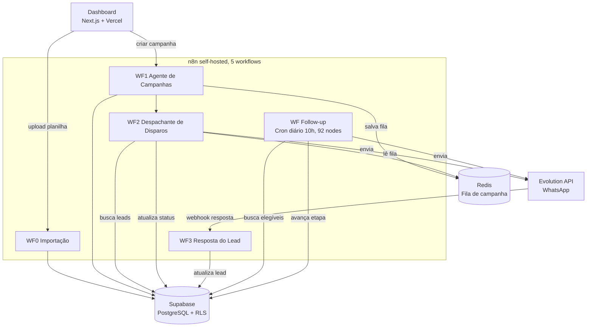

# ReativaLead

> **Plataforma de prospecção ativa e disparo em massa via WhatsApp.**
> Construído para times comerciais que investem em tráfego pago e perdem a maior parte dos leads gerados por falta de follow-up consistente. Foco inicial de go-to-market no mercado imobiliário, com arquitetura genérica que serve qualquer setor que precise reativar base de leads em escala.

  

> 📌 Este repositório é um case study técnico do ReativaLead. O código-fonte do produto é fechado. Aqui você encontra a arquitetura, decisões técnicas e estado atual do projeto.

---

## O problema

Empresas que investem em tráfego pago perdem a maior parte dos leads gerados por incapacidade operacional de fazer follow-up consistente em escala.

O caso mais visível é o de pequenas imobiliárias que gastam de R$ 2.000 a R$ 5.000 por mês em Meta Ads ou Imoblead, geram 200 a 500 leads por mês, e nunca recontactam a maior parte dessa base. Mas o mesmo padrão aparece em qualquer setor que dependa de captura por anúncio: clínica, academia, curso, serviço.

O motivo é estrutural, não falta de vontade:

- **Volume.** Um operador com 500 leads na planilha não tem como ligar pra todos, muito menos fazer 4 toques de follow-up em cada.
- **Consistência.** Follow-up manual depende de disciplina. O time prioriza leads novos e a base antiga vira cemitério.
- **Personalização em escala.** Copiar e colar mensagem personalizada pra 300 leads no WhatsApp é inviável: demora horas e é propenso a erro.

Resultado: a maior parte do investimento em tráfego é desperdiçada porque o lead não recebe nem a primeira mensagem de retomada.

## A solução

O ReativaLead automatiza o reaquecimento dessa base parada e a qualificação inicial via WhatsApp, devolvendo ao time comercial **apenas os leads que demonstraram interesse**.

### Funcionalidades principais

- **Importação inteligente de planilha.** Upload de CSV/XLSX com auto-detecção de cabeçalho, mapeamento flexível de colunas, normalização de telefone e merge de duplicatas.
- **Campanha com rodízio de templates.** 3 mensagens por tipo alternando automaticamente entre leads, com verificação prévia no WhatsApp antes do envio.
- **Follow-up automático de 4 toques.** Sistema avança o lead por 4 etapas (3, 5, 7, 7 dias) sem intervenção. Cada etapa tem templates próprios.
- **CRM inline editável.** Status, etapa, prioridade e observações editáveis direto na tabela, sem abrir formulários.
- **Dashboard com métricas em tempo real.** Funil de conversão, taxa de resposta por etapa de follow-up, controle de limites diários e mensais.

### Fluxo do operador

1. Login no dashboard
2. Importa planilha de leads (drag-and-drop, mapeia colunas, confirma)
3. Cadastra templates de mensagem (3 por tipo)
4. Cria campanha aplicando filtros, vê prévia, confirma disparo
5. Sistema executa com delay aleatório (12 a 25 segundos entre envios)
6. Follow-ups disparam nos dias seguintes sem ação manual
7. Operador trata **apenas os leads que responderam**

### Fluxo do lead

Recebe mensagem personalizada no WhatsApp. Silêncio aciona follow-up 1 após 3 dias. Silêncio aciona follow-up 2 após 5 dias. Mais 2 toques de 7 dias. Se ainda em silêncio depois disso, fica marcado como finalizado. Resposta em qualquer etapa interrompe o ciclo e notifica o operador.

---

## Arquitetura

### Camadas

| Camada | Tecnologia | Responsabilidade |
|---|---|---|
| Frontend | Next.js 16, TypeScript, Tailwind, shadcn/ui | Dashboard, CRM, campanhas, templates |
| Autenticação | Supabase Auth | Login, JWT, base do RLS |
| Banco | Supabase (PostgreSQL) | Leads, campanhas, templates, contadores |
| Automação | n8n self-hosted em Docker Swarm | 5 workflows orquestrando o backend |
| Fila | Redis | Fila de disparo por campanha |
| Mensageria | Evolution API v2 (MVP) | Envio, verificação de número, webhook de resposta |
| Deploy | Vercel (front) e VPS (backend) | Separação clara front/back |

### Multi-tenancy

Isolamento por **Row-Level Security (RLS) nativa do PostgreSQL**. Cada tabela tem policy `user_id = auth.uid()`, então um cliente nunca enxerga dado de outro, mesmo se a aplicação tiver bug. Redis usa chaves prefixadas por `user_id` (`disparo:{user_id}:fila`). Onboarding de novo cliente leva ~15 minutos via dashboard admin.

---

## Decisões técnicas

Algumas escolhas valeram debate antes de virar código.

### 1. n8n self-hosted em vez de serverless functions

**Decisão.** Toda a lógica de backend roda em workflows n8n self-hosted (Docker Swarm), não em Lambda, Edge Functions ou API server tradicional.

**Por quê.** O fluxo de follow-up tem 92 nodes em 5 ramos paralelos. Gerenciar essa complexidade em código serverless seria impraticável. Qualquer mudança exigiria deploy completo e debug remoto. Em n8n, o fluxo é visual, debugável node a node, e cada execução fica registrada em histórico.

**Trade-off.** Precisa manter servidor de pé, com o custo e a manutenção que vem junto. Em troca, ganho velocidade de iteração absurda. Uma mudança no follow-up que levaria meio dia em código leva 15 minutos no n8n.

### 2. Evolution API self-hosted (MVP) em vez de WhatsApp Business API oficial

**Decisão.** Mensageria via Evolution API (Baileys, WhatsApp Web) em VPS própria, não via BSP comercial (Meta Cloud API, Zapster).

**Por quê.** Custo. API oficial cobra R$ 0,15 a R$ 0,80 por mensagem. Em campanha de 1.000 leads com 4 toques de follow-up, isso já vira R$ 600 a R$ 3.200. Inviável pro ticket-médio do cliente-alvo no MVP.

**Trade-off.** Maior risco de banimento, menor estabilidade, sem selo verificado. Decisão consciente para MVP. Migração para Zapster (BSP comercial) já planejada quando receita justificar.

### 3. Redis como fila em vez de BullMQ ou SQS

**Decisão.** Fila de campanha em chaves Redis simples (`LPUSH`, `RPOP`), sem worker dedicado.

**Por quê.** O próprio n8n é o consumer. Ele lê o Redis dentro do workflow. Adicionar BullMQ exigiria um worker Node.js separado só pra rodar a fila, dobrando a superfície de manutenção pra ganho marginal.

**Trade-off.** Sem retry automático, sem dead-letter queue. Aceito para o volume atual (abaixo de 1.000 leads por campanha). Se a operação passar disso, troca pra BullMQ.

### 4. Rodízio de templates por hash de UUID em vez de round-robin com estado

**Decisão.** Para distribuir os 3 templates entre N leads, usa o último caractere do UUID do lead como seed (`hex % 3`).

**Por quê.** Stateless. Não precisa de contador global, não precisa de lock, não há race condition. Cada lead recebe seu template determinístico baseado no próprio UUID.

**Trade-off.** A distribuição não é exatamente 33/33/33. A aleatoriedade dos UUIDs gera variação de poucos pontos. Aceito.

---

## Estado atual

**Em produção, com 2 pilotos ativos há ~2 meses.** Primeira cliente piloto, corretora em Pelotas-RS (~1.800 leads na base), e uso interno da própria Mind in Shift para prospecção comercial da agência.

Números acumulados no período:

| Métrica | Valor |
|---|---|
| Disparos iniciais executados | **400** |
| Respostas recebidas | **80** (taxa de **20%**) |
| Leads em fase final de qualificação para assinatura | **2** |
| Clientes em produção | 2 |

A taxa de resposta de **20% está acima do benchmark típico de cold outreach via WhatsApp** (geralmente 5 a 10%), o que valida o efeito combinado de rodízio de templates, personalização por variável e verificação prévia de número.

### Capacidade técnica

- ~200 mensagens por hora por instância
- ~2.200 por dia em janela comercial
- Limites de plano (100, 300 ou 500 por dia) são intencionalmente inferiores à capacidade técnica, como margem de segurança contra banimento

### Próxima validação

Primeira campanha de escala real (~1.800 leads da base da corretora piloto), em curso. O objetivo é medir a taxa de resposta no volume maior e validar a estabilidade da Evolution API nesse patamar. Único gap relevante entre o estado atual e a operação em escala.

---

## Limitações conhecidas

- **Sem entrada automática de leads.** Para o foco inicial em imobiliária, os CRMs do setor (Imoblead e similares) não oferecem API aberta. Entrada via upload manual de planilha. Para outros setores, a integração depende da disponibilidade de API do CRM ou plataforma de captura específica. Webhook de integração planejado quando viável.
- **Volume acima de 5.000 leads por campanha.** O `SplitInBatches` do n8n processa sequencialmente. Campanhas desse porte podem levar mais de 24 horas. Próximo passo: paralelização com múltiplas instâncias.
- **Observabilidade limitada.** Sem APM dedicado (Sentry, Datadog). Detecção de erros via logs do n8n e Supabase. Aceitável no volume atual, planejado pra escala.
- **Internacionalização.** Normalização de telefone assume formato brasileiro (DDD 2 dígitos + 9 dígitos). Adaptação necessária pra outros mercados.

---

## Roadmap (próximos 3 a 6 meses)

- Primeira campanha de escala (1.800+ leads) com métricas reais de taxa de resposta
- Migração de Evolution API para Zapster (BSP comercial, maior estabilidade, menor risco de banimento)
- Landing page do produto e funil de aquisição
- 5 a 10 clientes pagantes
- Notificação em tempo real para o operador quando lead responde
- Integração com webhooks de CRMs e plataformas de captura (Imoblead como prioridade pelo foco inicial em imobiliária)

---

## Stack

- **Frontend.** Next.js 16, TypeScript, Tailwind CSS, shadcn/ui
- **Backend.** n8n 2.17.7 (self-hosted em Docker Swarm), Edge Functions (Supabase)
- **Banco.** PostgreSQL (Supabase) com RLS nativo, 8 tabelas principais, índice único parcial em `(user_id, telefone)` para merge-duplicates
- **Cache e fila.** Redis 7.4 Alpine
- **Mensageria.** Evolution API v2 (Baileys), migração pra Zapster planejada
- **IA.** GPT-4o-mini (OpenAI) para o agente conversacional do Chatwoot pós-resposta
- **Auth.** Supabase Auth, JWT, RLS por `auth.uid()`
- **Hosting.** Vercel (frontend), VPS dedicada (n8n, Redis, Evolution API)

---

## Sobre

Construído por [Guilherme Bosco](https://github.com/Guilherme-Bosco), co-founder da [Mind in Shift](https://mindinshift.com.br), agência de automação e IA em Jacareí-SP.

Para contato sobre o produto ou consultoria técnica em automação: [contato@mindinshift.com.br](mailto:contato@mindinshift.com.br), [LinkedIn](https://www.linkedin.com/in/guilherme-bosco-dos-santos-012bb620b/).
